# Base designs tuto

The document [Base_designs.pdf](https://github.com/sdenis6/Base_Designs_tuto/blob/master/Base_designs.pdf) provides a first help of how to build numerical RF designs/bitstreams for fpga boards, using Vivado and the IPs available with the project [OscillatorIMP](https://github.com/oscimp). 

Summary:

1. Reminder on signal dynamics
2. Webserver
3. Double voltage source
4. Double DDS
5. Amplitude modulation
6. Sine perturbation of a signal
7. Frequency and phase modulation of a NCO
8. Filtering
9. Demodulation
10. Monitoring
11. Example to a control loop

## IPs as RF functions

| IP | Equivalent RF function   *or numeric function* | Equivalent scheme with tuneable entries |
| ----------- | :-----------: | :-----------: |
| 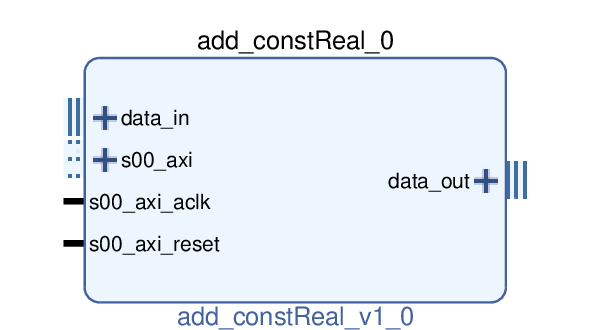 | Tunable amplitude offset, bias.   *The added offset value is internal to the block.* | 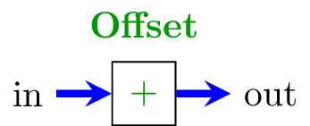 |
| 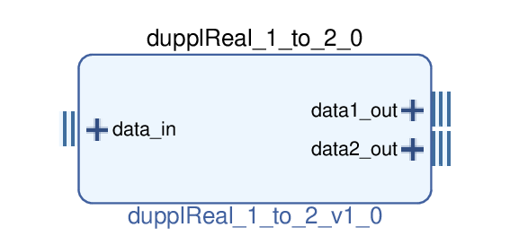 | Splitter | 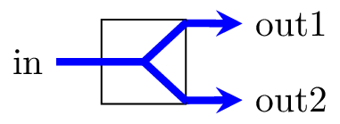  |
| 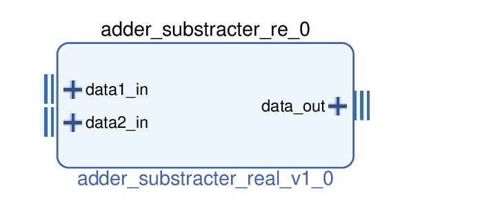 | Combiner.   *Add or subtract signals. The added/subtracted signal is external to the block unlike the add\_const block.* | 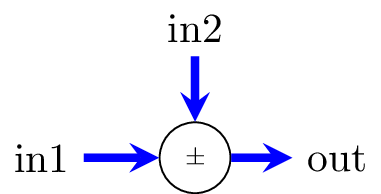  |
| 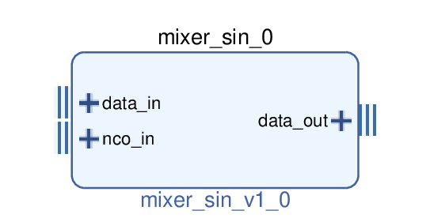 | Mixer, multiplier. | 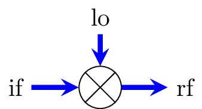 |
| 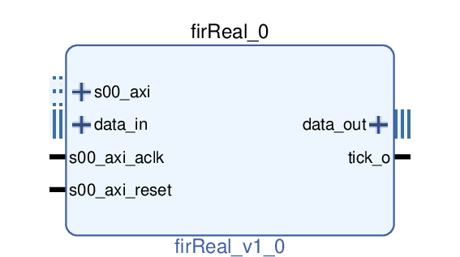 | Tunable filter.   *FIR with decimation option.* | 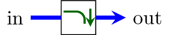  |
| 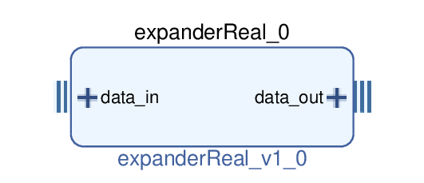 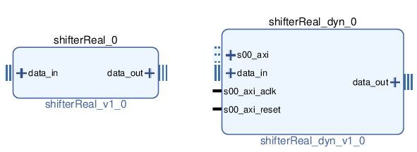 | Can be assimilated to 2^m amplifiers or attenuators.   *Are used to adapt the data size between blocks, or to select the range of the numeric signal.  Expander: crop end of word, expand beginning of word. Shift: crop beginning of word, expand end of word.* | 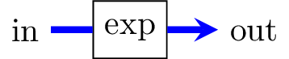 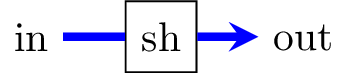 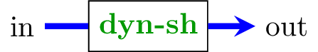  |
| 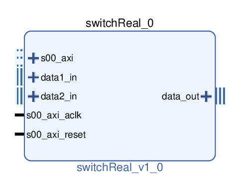 | Switch | 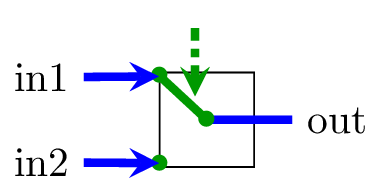  |
| 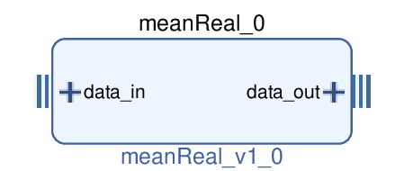 | Moving average.   *Decimation of 2^n with averaging: slows the data flow.* | 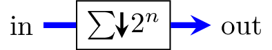  |
| 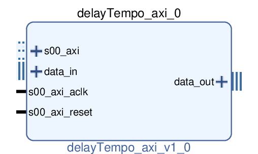 | Tunable delay line ie. cables. | 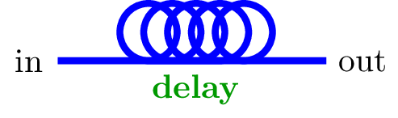  |
| 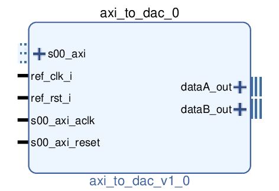 | Tunable voltage source.   *Controllable states/constants.*  | 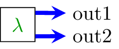  |
| 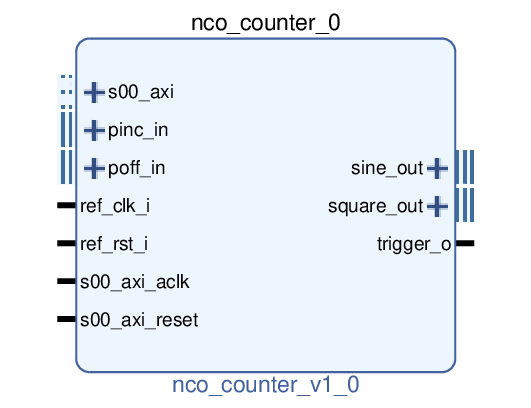 | DDS  *NCO* | 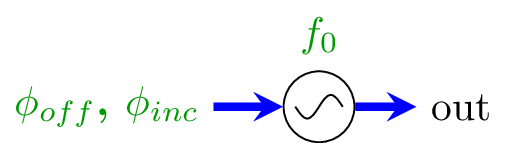  |
| 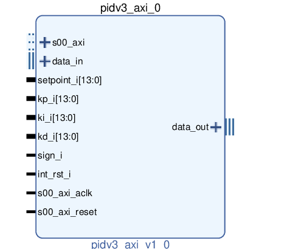 | PID  | 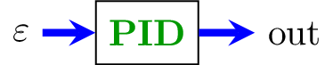  |
| 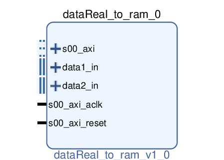 | Monitoring: oscilloscope, spectrum analyzer...   *Can also be used to process the signal in the CPU. Up to 12 channels.* | 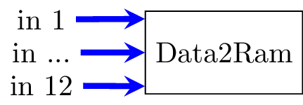  |
| 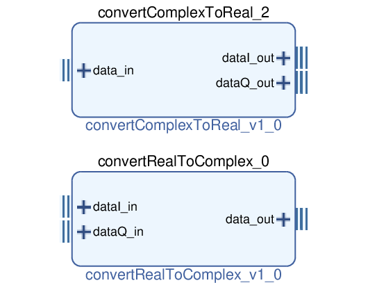 | Split or combine In-phase and Quadrature components.   *Convert R to C or C to R.* | 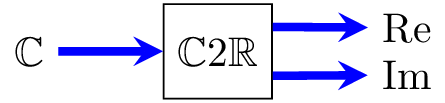 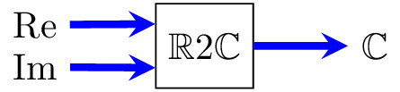  |
